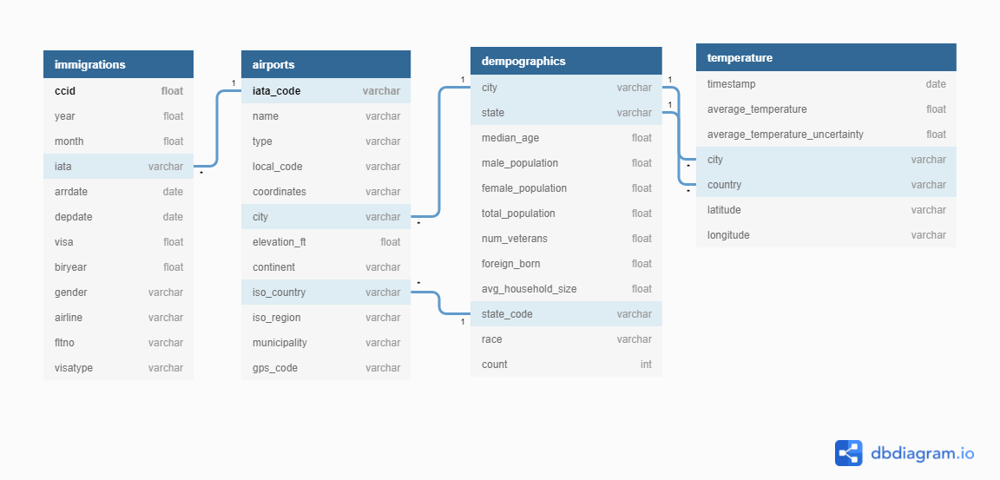

# CapstoneProject

This capstone project utilizes data from multiple data sources, using immigration data in US ports, temperature, airports and demographics data. Data goes through cleaning process, it gets filtered and prepared to fit defined data model within ETL pipeline. For data processing, pandas is used. As a database solution, postgres has been chosen.

## Data sources

### I94 Immigration Data
This data comes from the US National Tourism and Trade Office and can be found [here](https://www.trade.gov/national-travel-and-tourism-office).

### World Temperature Data
This data comes from Kaggle and can be found [here](https://www.kaggle.com/berkeleyearth/climate-change-earth-surface-temperature-data).

### U.S. City Demographic Data
This data comes from Open Data Soft and can be found [here](https://public.opendatasoft.com/explore/dataset/us-cities-demographics/export/).

### Airport Code Table
This data comes from datahub and can be found [here](https://datahub.io/core/airport-codes#data).

## Data preparaton

In this part, following techniques are applied :
* Removing missing values from the dataframes
* Filtering temperature data on US only
* Converting SAS dates into date compatible with python/postgres.
* Merging of datasets and preparing input datasets for final data model.

## Data Model
Data model implements snowflake schema, where some dimension tables reference to other dimensional tables.
Fact table references to other dimensional tables over iata_code as a foreign key.

### Tables:
| table name | description | type |
| ------- | ----------- | ----------- |
| airports | contains airport related data | dimensional table |
| demographics | contains demographics data for specific city/country | dimensional table |
| immigrations | contains i94 immigrations data | fact table |
| temperature | temperature information for US | dimensional table |

### Data model diagram:

## Process flow

1. Create tables and database by running `create_tables.py`.
2. Import raw data
3. Clean and process data
4. Prepare data for data model
5. Insert data
6. Perform quality checks
6. Demonstrate example of data model in use within jupyter notebook.

As a final production solution, `etl.py` file is provided.